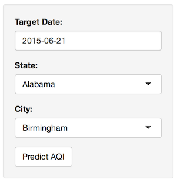
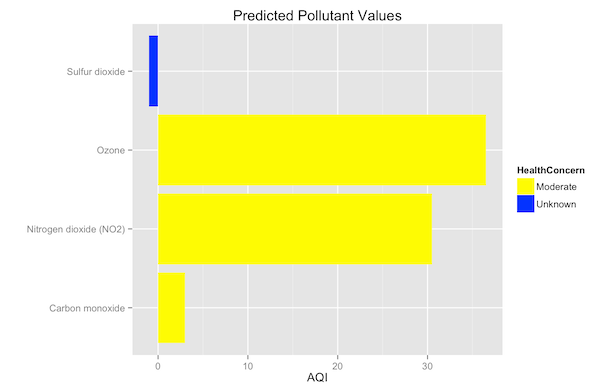

## Introduction ##

The EPA created the Air Quality Index (AQI) as a means of measuring daily air quality and alerting individuals with respiratory and/or heart conditions when low air quality conditions occur.  The AQI scale ranges from 0 to 500, with 0 being the best rating and 500 being the most dangerous rating.  

Although the EPA provides a number of utilities for calculating AQI, it does not provide a tool for predicting AQI values.  However, a prediction tool would be useful for athletes, vacation travelers, and anyone who may be affected by hazardous air conditions.

If only such a tool existed...

---

## FabAQI ##

Enter FabAQI...an air quality prediction application.  FabAQI uses historical AQI values provided on the [EPA Air Quality](http://aqsdr1.epa.gov/aqsweb/aqstmp/airdata/download_files.html#Daily) website to predict the AQI for four common air pollutants.

FabAQI is designed for simplicity.  Users simply select a date/location and click the Predict AQI button. 



--- 

## AQI Predictions ##

FabAQI predicts the AQI value by calculating the average AQI value for the specified date over the past two years. (2013-2014)  Rather than having to remember index values and the meaning of the colors, users can simply glance at the graph and determine the risk level for each pollutant.  FabAQI also presents users with a legend that correlates the pollutants to various health conditions.

```{r SampleGraph, warning = FALSE, fig.cap="Test Caption", results="asis"}
library(xtable)
source('../model.R')
tab <- xtable(getRisks())
print(tab, type="html", include.rownames=FALSE)
```

---

## AQI Output ##

FabAQI generates a [color coded](http://airnow.gov/index.cfm?action=aqibasics.aqi) box plot of the four AQI values to allow users to quickly determine their risk level.  No degree in environmental science required!


